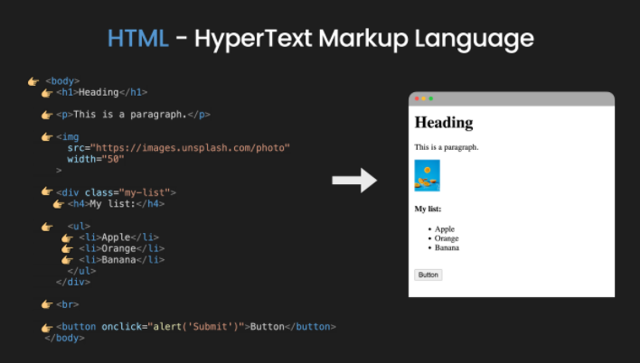
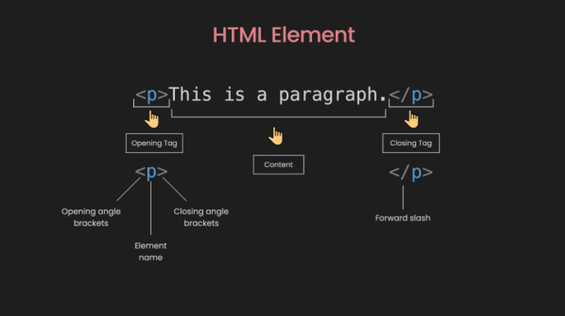
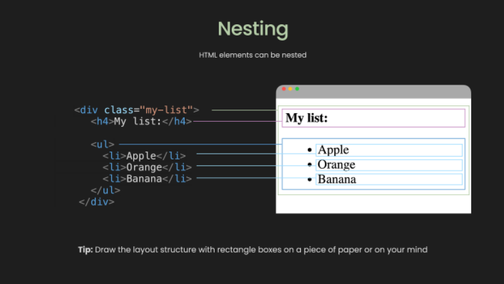
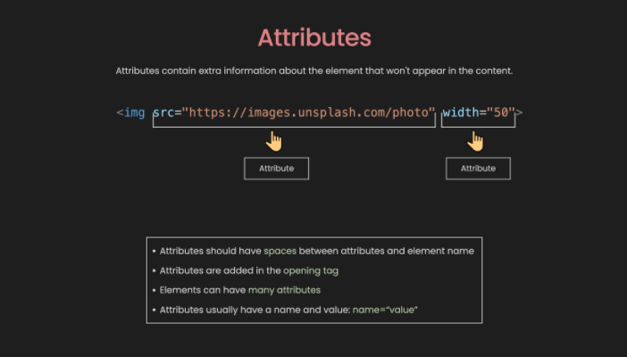
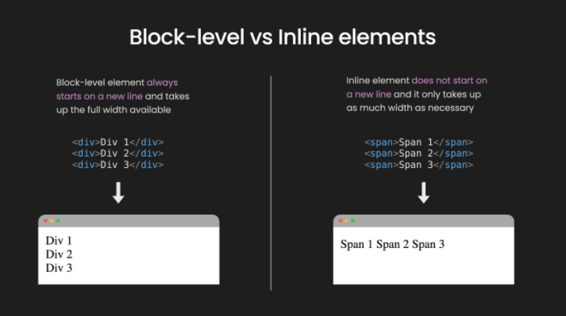

# Level 2 - HTML basics

In this lesson you will learn basic of HTML and you will go through following topics:

- [What Is HTML?](#what-is-html)
- [What Are HTML Elements?](#what-are-html-elements)
- [How to Nest HTML Elements](#how-to-nest-html-elements)
- [What are HTML Attributes?](#what-are-html-attributes)
- [Common HTML elements](#common-html-elements)
- [Resources](#resources)

At the end it's time to put your newly learned skills into practice. Follow the link [HTML Practice](./HTML-practice.md) to create your very first page. If you will get stuck, check [HTML Cheat sheet](./HTML%20Cheat%20Sheet.md) for some useful tips.

## What Is HTML?

HTML, which stands for Hypertext Markup Language, is a pretty simple language. It consists of different elements which we use to structure a web page.



## What Are HTML Elements?

The element usually starts with an opening tag, which consists of the name of the element. It's wrapped in opening and closing angle brackets.
The opening tag indicates where the element begins. Similar to the opening tag, the closing tag is also wrapped in opening and closing angle brackets.
But it also includes a forward slash before the element's name. Everything inside the opening and closing tags is the content.



But not all elements follow this pattern. We call those that don't empty elements. They only consist of a single tag or an opening tag that cannot have any content.
These elements are typically used to insert or embed something in the document.

For example, the `img` element is used to embed an image file, or the input element is used to insert an `input` onto the page.

```

```

In the example above, the `img` element only consists of one tag that does not have any content.
This element is used to insert an image file from Unsplash in the document.

## How to Nest HTML Elements

```
<div class="my-list">
  <h4>My list:</h4>
  <ul>
     <li>Apple</li>
     <li>Orange</li>
     <li>Banana</li>
  </ul>
</div>
```

Elements can be placed inside other elements. This is called Nesting. In the example above, inside the `div` element we have an `h4` element and an `ul` or unordered list element.
And Similarly inside the `ul` element, there are 3 `li` or list item elements.

Basic nesting is quite straight-forward to understand. But when the page gets larger, nesting can become complicated.

Therefore, before working with HTML, think about the layout structure you would like to have. You can draw it out on a piece of paper or in your mind. It will help a lot.



## What are HTML Attributes?

Elements also have attributes, which contain extra information about the element that will not appear in the content.

```

```

In the example above, the `img` element has 2 attributes: `src` or source to specify the path of the image, and width to specify the `width` of the image in pixels.



With this example, you can see the following characteristics of attributes:

- There is a space between attributes and the element name
- Attributes are added in the opening tag
- Elements can have many attributes
- Attributes usually have a name and a value: name=“value”

But not every attribute has the same pattern.
Some can exist without values, and we call them Boolean Attributes.

```
<button onclick=“alert('Submit')" disabled>Button</button>
```

In this example, if we want to disable the button, all we have to do is pass a disabled attribute without any values.
This means that the presence of the attribute represents the true value, otherwise, the absence represents the false value.

## Common HTML elements

There are in total more than 100 elements.
But 90% of the time you will only use around 20 of the most common.
We can put them into 5 groups:

### Section elements

```
<div>, <span>, <header>, <footer>, <nav>, <main>, <section>
```

These elements are used to organize the content into different sections.
They are usually self-explanatory, for example, `header` usually represents a group of the introduction and navigation section, `nav` represents the section that contains navigation links, and so on.

### Text content

```
<h1> to <h6>, <p>, <div>, <span>, <ul>, <ol>, <li>
```

These elements are used to organize content or text blocks.
They are important to accessibility and SEO. They tell the browser the purpose or structure of the content.

### Forms

```
<form>, <input>, <button>, <label>, <textarea>
```

These elements can be used together to create forms that users can fill out and submit. Forms might be the trickiest part of HTML.

### Images and Links

```
, <a>
```

These elements are used to insert an image or create a hyperlink.

### Others

```
<br>, <hr>
```

These elements are used to add a break to the webpage.

You can find all the elements on [developer.mozilla.org](developer.mozilla.org).
But for beginners, you just need to know the most common ones.

### Block-level vs inline HTML elements

By default, an element can be either block-level or an inline element.

Block-level elements are the elements that always start on a new line and take up the full width available.

Inline elements are the elements that do not start on a new line and it only take up as much width as necessary.



Two elements that represent block-level and inline elements, respectively, are `div` and `span`.
In this example, you can see that the `div` elements takes 3 lines, whereas the `span` element only takes up 1 line.

But the question is: how do we know which ones are block-level elements and which ones are inline elements?
Well, unfortunately you need to remember them. The easiest way is to remember which are inline elements – and the rest are block elements.

If we look back at the most common HTML elements, inline elements include:

```
<span>, <input>, <button>, <label>, <textarea>, , <a>, <br>
```

### How to comment in HTML

```
<p>This is a paragraph.</p>

<!-- <p>I am not showing.</p> -->
```

The purpose of comments is to include notes in the code to explain your logic or simply to organize your code.

HTML comments are wrapped in the special markers: `<!-- and -->` and they are ignored in the browser.

### How to use HTML entities

What if you want to show the text: the `<p>` tag defines a paragraph., but the browser interprets `<p>` as an opening tag for a new element?
In this case, we can use HTML entities like in the following example:

```
<p>the <p> tag defines a paragraph.</p>

<p>the &lt;p&gt; define a paragraph.</p>
```

### Common beginner mistakes in HTML

1. Tags/Element names
   Tags/Element names are cAse-inSensitive. This means that they can be written in lowercase or uppercase, but it is recommended that you write everything in lowercase: `<button>` not `<ButTon>`.

2. Closing tag
   Failing to include a closing tag is a common beginner error. Therefore, whenever you create an opening tag, immediately put in a closing tag.

3. Nesting
   This is wrong:

```
<div>Div 1 <span> Span 2 </div></span>
```

The tags have to open and close in a way that they are inside or outside one another.

4. Single quotes and Double quotes
   This is wrong:

```

```

You cannot mix single quotes and double-quotes. You should always use double quotes and use HTML entities if needed.

## Resources

- [Traversy Media](https://www.youtube.com/watch?v=UB1O30fR-EE)
